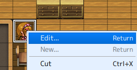
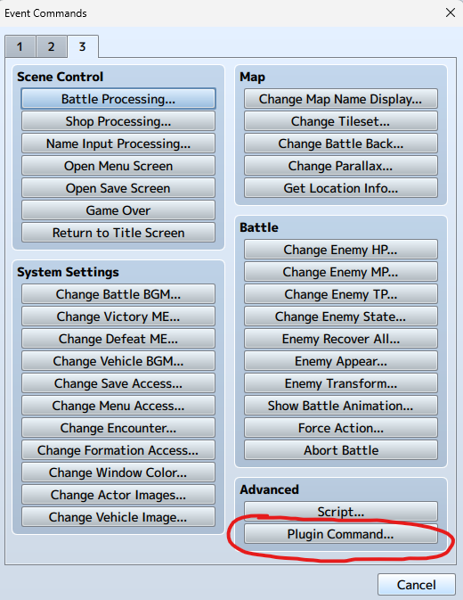
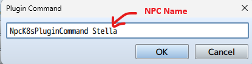

# k8s-isekai

Kubernetes Isekai (異世界） is an open-source RPG designed for hands-on Kubernetes learning through gamification. Ideal for junior to Higher Diploma students of Hong Kong Institute of Information Technology (HKIIT), it transforms Kubernetes education into an engaging adventure.

1. Role-Playing Adventure: Students interact with NPCs who assign Kubernetes tasks.
2. Task-Based Learning: Tasks involve setting up and managing Kubernetes clusters.
3. Free Access: Uses AWS Academy Learner Lab with Minikube or Kubernetes.
4. Scalable Grading: AWS SAM application tests Kubernetes setups within AWS Lambda.
5. Progress Tracking: Students track progress and earn rewards.
6. This game offers practical Kubernetes experience in a fun, cost-effective way.
7. GenAI Chat: Integrates Generative AI to make NPC interactions more dynamic and fun, enhancing the overall learning experience.

This repository hosts a Web RPG game that you can fork and customize to your liking.

AWS SAM Repo for Backend

https://github.com/wongcyrus/k8s-grader

Kubernetes Unit Test for Game Rule

https://github.com/wongcyrus/k8s-game-rule

## Demo

[](https://youtu.be/dIwNWwz681k)

# Development

This game was created using [RPG maker](https://www.rpgmakerweb.com/), with a custom plugin, "NpcK8sPluginCommand.js," located in the "js\plugins" directory.
You can modify the game within RPG Maker. To enable non-player characters (NPCs) to interact with the k8s-grader-api, you must configure the Plugin Command.

## How to set the NPC NpcK8sPluginCommand?

1. **Open the NPC Editor:** Right-click the NPC and select "Edit" from the context menu.

   

2. **Access Plugin Commands:** Within the NPC Editor, click the "Plugin Command" button.

   

3. **Define the Plugin Command:** Enter the desired command in the provided field. Ensure the command includes the unique NPC name as defined in the `NpcBackgroundTable`.

   

## Game Development and Testing

1. Open the game folder in VS Code.
2. Install the [Live Server](https://marketplace.visualstudio.com/items?itemName=ritwickdey.LiveServer) extension.
3. Right-click `index.html` and select "Open with Live Server."
4. Set the query parameters:
   `?wsUrl=wss://GAME_WS_API.execute-api.us-east-1.amazonaws.com/Prod&game=game01&apiKey=INDIVIDUAL_API_KEY`

### Local HTTPS test server with a self-signed certificate

If you want to test the browser game from a local HTTPS origin, you can use the helper below.

1. Create a local self-signed certificate:

   ```bash
   openssl req -x509 -newkey rsa:2048 -sha256 -nodes \
     -keyout localhost-key.pem \
     -out localhost-cert.pem \
     -days 365 \
     -subj "/CN=localhost"
   ```

2. Start the local HTTPS server from the repo root:

   ```bash
   python3 python_tools/local_https_server.py \
     --host 127.0.0.1 \
     --port 8443 \
     --cert localhost-cert.pem \
     --key localhost-key.pem
   ```

3. Open the game with HTTPS query parameters, for example:

   ```text
   https://127.0.0.1:8443/index.html?wsUrl=wss://GAME_WS_API.execute-api.us-east-1.amazonaws.com/Prod&game=game01&apiKey=INDIVIDUAL_API_KEY
   ```

Notes:

- A local self-signed page can still call the AWS WebSocket API if the page is opened successfully in the browser and the WebSocket endpoint itself uses a valid `wss://` certificate.
- Browsers do **not** apply normal CORS rules to WebSockets the same way they do for `fetch`/XHR, so the main requirement is that the page is loaded and the WebSocket target is `wss://...`, not `ws://...`.
- You may need to manually trust or bypass the local certificate warning in the browser before the page and its JavaScript can run.
- The game plugin now requires `wsUrl`; it no longer falls back to the HTTP `/task` endpoint.

## Core Developers

Students from [Higher Diploma in Cloud and Data Centre Administration](https://www.vtc.edu.hk/admission/en/programme/it114115-higher-diploma-in-cloud-and-data-centre-administration/)

- [錢弘毅](https://www.linkedin.com/in/hongyi-qian-a71b17290/)
- [Ho Chun Sun Don (何俊申)](https://www.linkedin.com/in/ho-chun-sun-don-%E4%BD%95%E4%BF%8A%E7%94%B3-660a94290/)
- [Kit Fong Loo](https://www.linkedin.com/in/kit-fong-loo-910482347/)
- [Yuehan WU](https://www.linkedin.com/in/yuehan-wu-a40612290/)
